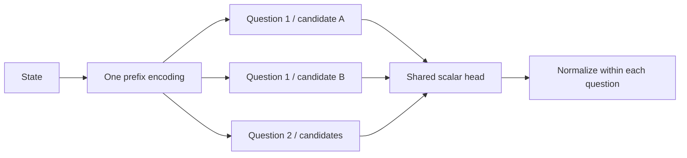

# OpenJev

**New: [multimodal visual-posterior research](docs/VISION.md)** —
public images, original synthetic uncertainty data, trained baselines and
[measured failures on unseen compositions](reports/vision-v01/RESULTS.md).

[](https://github.com/IamBusy/OpenJev/actions/workflows/ci.yml)

[Hugging Face model](https://huggingface.co/IamBusy/OpenJev-0.6B) · [中文](README.zh-CN.md) · [Results](reports/v03/RESULTS.md) · [Reproduce](docs/REPRODUCING.md) · [Model card](docs/MODEL_CARD.md)

**Small, local models for typed probabilistic decisions.** The published model is
**OpenJev-0.6B**; model revisions and software releases are tracked separately. Give OpenJev a state,
questions and candidate descriptions. It returns probabilities for `choice`,
`noul` (probability of truth), and ordinal `score`, without decoding answer tokens.

OpenJev is an independent research project inspired by TypeSafe's Jev. It is not
affiliated with TypeSafe and does not reproduce Jev's undisclosed weights,
architecture or RLCD algorithm. Training here uses supervised cross entropy and
held-out temperature calibration. **This is an experimental release.**

## What is included

| Track | Model | Purpose |
| --- | --- | --- |
| v0.3 | Qwen3-0.6B + LoRA + scalar head | Shared state prefix, independent candidate scoring; current experiment |
| v0.2 | Qwen3-0.6B + LoRA | Letter-logit baseline, up to 26 candidates |
| v0.1 | Frozen MiniLM + residual head | Compact historical baseline |

v0.3 computes a state prefix once per request, then evaluates isolated
question/candidate branches. A shared 1,024-parameter head scores candidates;
1,146,880 LoRA parameters are also trained. Question IDs and candidate keys are
output handles, not model features. There is no persistent cross-request cache.



## Quick start

Use Python 3.12 and [uv](https://docs.astral.sh/uv/getting-started/installation/).
The measured runtime is Apple M3 Pro / macOS with BF16 inference. CPU uses FP32;
CUDA acceleration is not implemented in this release. Allow several GB of disk
space and RAM; the separately downloaded base weights are about 1.2 GB.

```bash
git clone https://github.com/IamBusy/OpenJev.git
cd OpenJev
uv sync --frozen --extra qwen --extra dev
uv run --no-sync openjev-model download
uv run --no-sync openjev-model predict --input examples/refund.json
```

`download` fetches a pinned Qwen base from Hugging Face and the small OpenJev
adapter/head bundle from this repository's release. It checks the release archive
and model file hashes. No model-service key is needed for inference or data
reconstruction. Run commands from the checkout, or supply `--root /path/to/OpenJev`
before the subcommand. Existing model files are verified rather than replaced.

```python
from pathlib import Path
from openjev import OpenJevModel

root = Path.cwd()
model = OpenJevModel(root, checkpoint=root / "artifacts/openjev-0.6b")
result = model.predict(
    state="The recorded color is red.",
    questions={
        "color": {
            "type": "choice",
            "instructions": "Which candidate agrees with the recorded color?",
            "criteria": {"red": "The color is red.", "blue": "The color is blue."},
        }
    },
)
print(result["answers"]["color"])
```

The Python example uses uncalibrated probabilities. The CLI loads the delivered
calibration file automatically. Calibration is specific to the measured mixture,
not a guarantee for a new domain.

## Load from Hugging Face

After installing the Qwen extra, no checkout-specific model directories are needed:

```python
from openjev import OpenJevModel
model = OpenJevModel.from_pretrained("IamBusy/OpenJev-0.6B")
```

This loads the trained LoRA, custom scoring head, calibration and pinned base.
See [Hub usage and adapter versus merged weights](docs/HUGGING_FACE.md).

## Contract

| Primitive | Input | Output |
| --- | --- | --- |
| `choice` | 2–255 named, distinct candidate descriptions | Distribution, selected key, maximum probability |
| `noul` | Proposition; optional explicit `false`/`true` descriptions | Probability of truth; **not** an abstention flag |
| `score` | 2–10 ordered rubric descriptions | Level distribution and expected zero-based level |

A v0.3 request supports at most 512 total candidate branches, a 768-token state
prefix and 192 tokens per candidate branch, including prompt overhead. Oversized
inputs fail explicitly. Questions do not attend to each other. Independently
scored candidates do not see the other candidates; set-relative instructions
such as “none of the above” need separate validation.

## Measured results and limits

The frozen experiment used 725 training judgments, 176 development judgments,
167 calibration judgments, 405 fresh test judgments and 448 older regression
judgments. Whole state groups stay within splits. Public pretraining overlap
cannot be ruled out.

| Same-input comparison | v0.2 | v0.3 |
| --- | ---: | ---: |
| Accuracy on the fixed 60-question reference subset | 39/60 | 45/60 |
| Candidate reversal consistency, fixed 16 questions | 68.75% | 100% |
| Long synthetic state, 8 questions × 4 candidates, warm median | 1.38 s | 0.70 s |
| Short state, 1 question × 4 candidates, warm median | 55 ms | 104 ms |

DeepSeek answered 59/60 on the same small reference subset. v0.3 changes both
architecture and data, so accuracy differences are **not** an architecture-only
ablation. Some banking, access-policy and shipping tasks regress. A 255-candidate
execution check establishes output shape, not general 255-way accuracy. Timings
are in-process measurements on one M3 Pro, not production latency or a comparison
with Jev. See [all task results and regressions](reports/v03/RESULTS.md).

## Local service

```bash
uv run --no-sync openjev-model serve --port 8081
curl http://127.0.0.1:8081/v1/decide \
  -H 'Content-Type: application/json' --data-binary @examples/refund.json
```

The service binds to localhost and serializes model calls. It has no authentication
or production deployment controls. Its `/v1/decide` endpoint is an OpenJev contract,
not a drop-in replacement for TypeSafe's API.

## Development and reproduction

```bash
uv run --no-sync pytest -q
uv run --no-sync ruff check src tests scripts
uv run --no-sync ruff format --check src tests scripts
uv build
```

CI runs CPU tests with a tiny randomly initialized Qwen model, including cached
versus recomputed outputs and gradients. Full model/data integration tests run
when local artifacts are present and otherwise skip explicitly. Rebuilding the
frozen data needs public source downloads but no provider credentials; see the
[complete reproduction guide](docs/REPRODUCING.md).

- [Names and versions](docs/NAMING.md), [Contributing](CONTRIBUTING.md), [security](SECURITY.md), [changelog](CHANGELOG.md)
- [Data examples](docs/DATA_WALKTHROUGH.md), [source attribution](THIRD_PARTY.md)
- [v0.3 protocol](docs/V03_PROTOCOL.md), [v0.2 report](reports/v02/RESULTS.md), [v0.1 report](reports/RESULTS.md)

Code and the original scenario generator are Apache-2.0. Public dataset texts
retain their source-specific licenses. Full corpora are fetched from pinned upstream
sources; the repository includes a few attributed schema examples. Model weights and research limitations are
documented in the [model card](docs/MODEL_CARD.md). Credentials, raw provider
traces, model caches and training runs are excluded from the source distribution.
