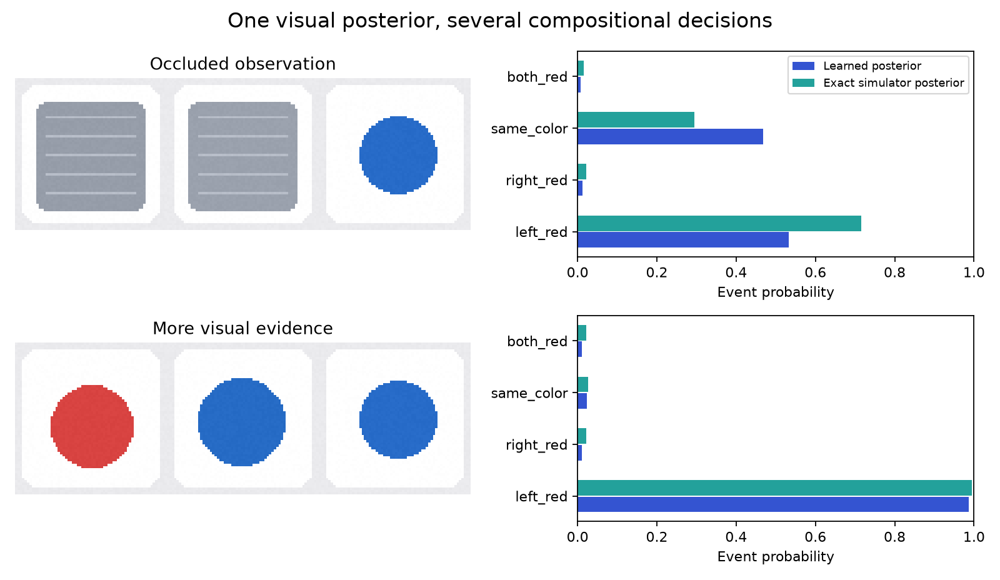

# OpenJev-Vision 多模态视觉后验研究

[数据集](https://huggingface.co/datasets/IamBusy/OpenJev-Vision-Research-v0.1) ·
[实验权重](https://huggingface.co/IamBusy/OpenJev-Vision) ·
[完整结果](../reports/vision-v01/RESULTS.md) · [英文复现指南](VISION.md)

目标是让多个视觉判断共享一个概率表示，并研究它在遮挡、依赖关系变化和未见组合下
是否仍然可靠。v0.1 已提供可运行模型、公开数据、原创合成数据和完整基线，
还没有宣称实现通用视觉推理或前沿科研突破。

## 已交付内容

- 8,192 张原创合成图像，保留已知观测模型下的精确后验。
- 2,960 张 Oxford-IIIT Pet 真实照片子集，核对官方编号、物种与划分。
- 1,680 张 CLEVR-4 图像，20 个颜色—形状组合不进入训练、开发和校准。
- 三类小型视觉模型、公开图像上的冻结 DINOv2 特征及分类/属性基线。
- 三组训练随机种子、独立校准、概率误差评估、组合泛化和共享计算实验。

合成图模型与公开照片模型是两个独立实验。合成图的精确概率来自指定生成过程；
公开照片的标签不是概率真值。查询使用声明好的事件语义，有限英语模板通过规则解析，
不能据此声称模型理解任意自然语言或识别任意视觉概念。

## 快速运行

~~~bash
uv sync --frozen --extra vision --extra dev
uv run --no-sync openjev-vision download
uv run --no-sync openjev-vision predict \
  --checkpoint artifacts/openjev-vision-v0.1/synthetic-joint \
  --image examples/vision/scene-0.png \
  --prior examples/vision/scene-0-prior.json \
  --questions examples/vision/questions.json
~~~

将 scene-0 换为 scene-1（图片和 prior 一起替换），可比较补充视觉证据前后的判断。
公开照片模型使用 download --backbone 获取固定版本 DINOv2，再按英文指南加载。

## 第一轮结果

保留相关性对训练分布内的组合概率有帮助，但直接学习整体后验对新依赖结构泛化较差。
在 CLEVR-4 的未见组合上，独立属性基线优于整体类别头和本次低秩交互基线。
这些负结果被完整保留，下一步新方法必须跨过它们。

代码采用 Apache-2.0；数据与权重按来源分别保留许可证，详见
[来源和许可](VISION_DATA.md)。Hugging Face 数据集可以直接读取图片、问题、
目标和来源信息，无需重新下载完整上游数据。
