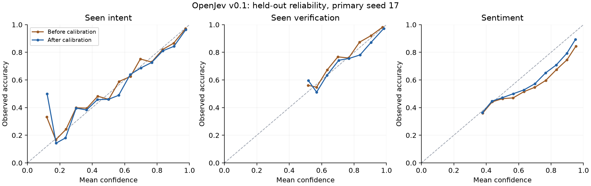
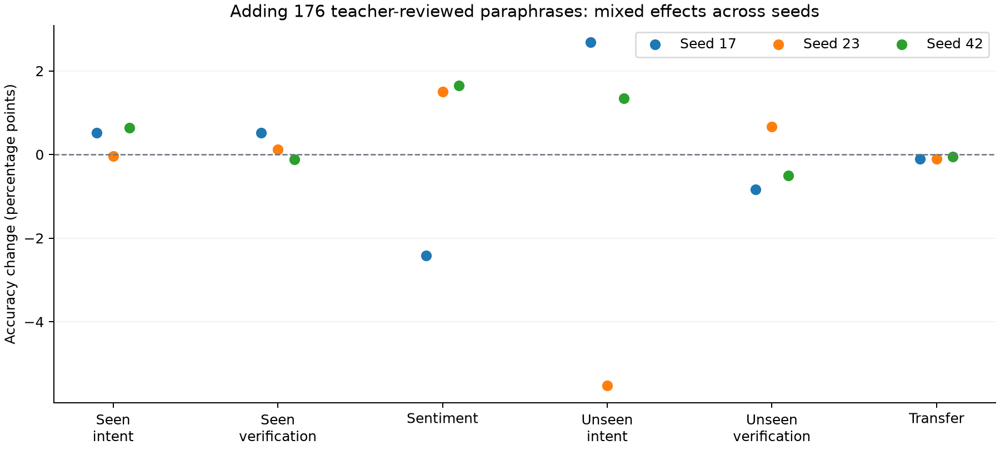

# OpenJev v0.1 实验报告

2026-09-19。全部训练、特征提取和本地推理在 Apple M3 Pro / 36GB 内存上完成；训练数据改写使用获授权的 DeepSeek API。代码、数据准备、训练、校准、独立评测、模型导出及离线重载均已执行。

## 结论

这个首版验证了小模型可以直接输出动态候选项的结构化概率分布。已见类别的任务性能明显优于冻结编码器的语义相似度基线；跨数据集能力仍有不足。少量合成数据的收益随任务和随机种子变化，当前证据不足以宣称合成数据稳定改善泛化。

这是一项最小可复现实验：冻结约 22.7M 参数的 MiniLM 编码器，训练 197,916 参数的共享残差评分头；没有微调整个编码器，也没有实现 TypeSafe 未公开的 RLCD。输出合法性、回答正确性和概率校准是不同性质。

## 数据及合成

| 数据分区 | 记录数 | 独立来源组数 |
| --- | ---: | ---: |
| test_transfer | 1,799 | 1,799 |
| test_unseen | 1,194 | 597 |
| test_id | 17,229 | 14,750 |
| test_simulator | 600 | 600 |
| calibration | 3,399 | 2,350 |
| dev | 3,331 | 2,315 |
| train | 19,351 | 13,267 |

另有 DeepSeek 合成训练记录 176 条；它们继承原训练样本的来源组，不当作新的独立标注样本。生成 192 条，独立教师复核剔除 16 条。共记录 48 次调用，输入 16,653 tokens，输出 6,999 tokens。没有新增调用用于随机种子复核。

公共来源是 BANKING77、TweetEval sentiment 和 CLINC150。另有本地 urn 模拟器，其标签为球数占总数的精确概率。处理保留官方测试边界，并按规范化原文做跨分区去重；同一原文的 Choice/Noul 视图、教师改写共享来源组。未见类别的 15 个 BANKING77 标签不用于训练、开发或校准。

BANKING77 已见类别选择使用 62 个已见类别加 other（63 候选），未见类别测试使用 15 个未见类别加 other（16 候选），所以二者准确率不能直接比较难度。CLINC 测试为预先固定的每类 10 条及 300 条 OOS，再去重，使用完整 151 候选。它是项目子集评测，不是官方全量排行榜结果。TweetEval 训练每类最多 1800 条，测试使用官方测试集经原文去重后的记录。

## 冻结模型选择后的测试结果

主发布模型始终为 seed=17 的两数据版本中开发集 NLL 更低者，即加入合成数据的版本。校准只使用 calibration 分区。下面的测试结果未用于更换主发布模型。

| 任务 | N | 语义基线准确率 | 仅公开数据 | 加入合成数据 |
| --- | ---: | ---: | ---: | ---: |
| BANKING77 已见类别选择 | 2,479 | 58.09% | 69.46% | 69.99% |
| BANKING77 已见类别真假判断 | 2,479 | 50.58% | 88.58% | 89.11% |
| TweetEval 情感等级 | 12,271 | 39.98% | 57.27% | 54.84% |
| BANKING77 未见类别选择 | 597 | 74.87% | 73.37% | 76.05% |
| BANKING77 未见类别真假判断 | 597 | 55.61% | 82.24% | 81.41% |
| CLINC 跨数据集迁移 | 1,799 | 49.08% | 47.03% | 46.91% |

温度缩放不改变分类 argmax，所以上表校准前后准确率相同。宏平均 F1、Wilson 区间、逐桶计数、Brier、NLL、等级 MAE、RPS 和风险/覆盖率曲线保存在对应的结果 JSON 中。

## 概率校准

| 任务 | 原始 NLL | 校准 NLL | 原始 ECE | 校准 ECE |
| --- | ---: | ---: | ---: | ---: |
| BANKING77 已见类别选择 | 0.9897 | 0.9881 | 0.0282 | 0.0333 |
| BANKING77 已见类别真假判断 | 0.2680 | 0.2699 | 0.0176 | 0.0200 |
| TweetEval 情感等级 | 0.9121 | 0.8984 | 0.1023 | 0.0732 |
| BANKING77 未见类别选择 | 0.8512 | 0.8680 | 0.0564 | 0.0646 |
| BANKING77 未见类别真假判断 | 0.4388 | 0.4771 | 0.0569 | 0.0780 |
| CLINC 跨数据集迁移 | 2.2968 | 2.3067 | 0.0307 | 0.0363 |

ECE 使用 15 个固定等宽区间。最大候选概率作为 confidence，校准域内拟合的温度不能保证新领域或新候选规模上的校准。风险/覆盖率计算保留阈值上的所有并列样本，报告实际覆盖率。

## 合成数据效应的随机种子复核

种子为 17、23、42；划分、超参数和数据不变。额外种子为诊断复核，不用于重选主模型。下面是加入合成数据减去仅公开数据的准确率差，单位为百分点。

| 任务 | 三种子均值 | 最小值 | 最大值 |
| --- | ---: | ---: | ---: |
| BANKING77 已见类别选择 | +0.38 | -0.04 | +0.65 |
| BANKING77 已见类别真假判断 | +0.17 | -0.12 | +0.52 |
| TweetEval 情感等级 | +0.24 | -2.42 | +1.65 |
| BANKING77 未见类别选择 | -0.50 | -5.53 | +2.68 |
| BANKING77 未见类别真假判断 | -0.22 | -0.84 | +0.67 |
| CLINC 跨数据集迁移 | -0.09 | -0.11 | -0.06 |

三个种子不足以提供精确的训练分布置信区间。单种子报告中的成对 bootstrap区间只反映测试样本不确定性，不能替代训练种子方差。特别是主种子的情感任务下降，不能被解释成所有种子上的稳定下降。

## 已知概率模拟器

这是额外的数值概率诊断，不是自然语言业务能力证明。软目标不按单个人工标签报告准确率；使用与真实分布的平方距离和期望 NLL。

| 方法 | 与真实分布的平方距离 | 期望 NLL |
| --- | ---: | ---: |
| 均匀分布 | 0.07915 | 1.33650 |
| 语义基线 | 0.18862 | 1.57710 |
| 训练并校准 | 0.09989 | 1.38231 |

模型在这个诊断中尚未胜过简单均匀分布；它没有学会可靠读取球数并计算真实概率。因此不能宣称首版已经普遍具备可信概率判断能力。

## 本机延迟与计算成本

M3 Pro，编码器 MPS、评分头 CPU，FP32。每种形状 3 次预热、20 次重复。计时包含验证、分词、编码、评分、校准和响应构造，不含模型加载或 HTTP 传输。不跨请求缓存 embedding；同一请求内完全相同的文本去重。下面是合成吞吐负载，不是业务正确率评测。

| 问题数 | 每题候选数 | p50 / ms | p95 / ms | 编码文本数 |
| ---: | ---: | ---: | ---: | ---: |
| 1 | 4 | 8.54 | 9.39 | 5 |
| 1 | 16 | 20.17 | 25.04 | 17 |
| 1 | 62 | 29.52 | 30.86 | 63 |
| 8 | 4 | 13.26 | 16.81 | 19 |
| 32 | 4 | 33.71 | 36.90 | 67 |

六次评分头训练合计约 109.6 秒，不含下载、首次编码与评测；这不是完整基础模型训练成本。本次模型加载约 0.50 秒。不能用这些本地数字和 Jev 的远端 API 延迟计算公平速度倍数。

## 可复现性与限制

- 原始文件版本、SHA-256、数据分区、来源组、模型配置、权重和校准参数均有记录。
- 合成数据可离线重放；教师标签来自同一模型族的复核，存在相关偏差。
- 权重导出后实际文本推理结果与原检查点一致，最大概率误差为 0。
- 增加了缓存命中/未命中不影响训练随机数的回归测试；主种子重新训练的两个权重均与初始结果逐字节一致。
- 候选置换及加入无关问题的实测最大概率差均在记录的容差内。
- 暂不保证中文、长文本、任意评分规则、复杂推理或生产级拒判。超过 192 tokens 的编码输入会披露截断。
- CLINC 总体迁移结果弱于语义基线，反映任务适配的负迁移风险。
- 不存在 Jev API 的同条件对比，因此不声称复现其性能或 RLCD。

## 下一阶段最值得做的实验

优先引入更多独立任务和高质量对比候选，做合成数据量与质量消融，再尝试微调编码器。每一轮保留新的评测任务，避免把目前已经分析过的测试集继续当作完全未见的最终验收集。先改进跨任务泛化和概率诊断，再扩大模型或引入强化学习。

来源、许可及引用见 [THIRD_PARTY.md](../THIRD_PARTY.md)。
