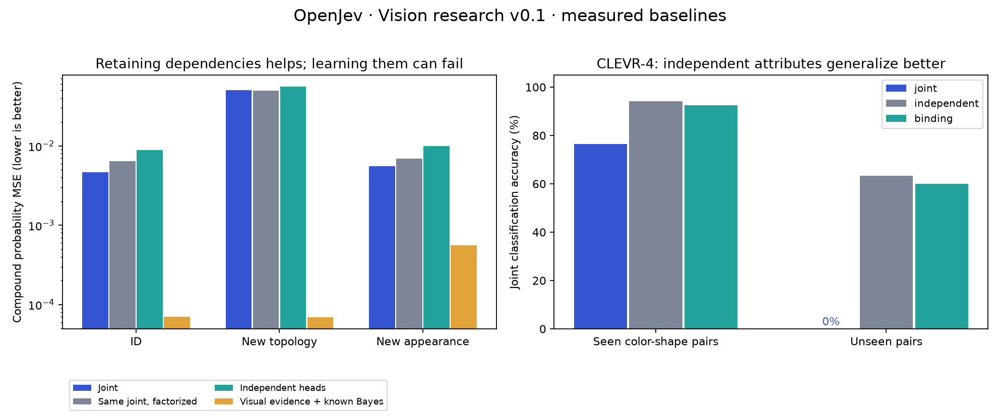

# OpenJev visual research v0.1 results

Experimental baselines, three seeds (17/23/42). No claim of a new state-of-the-art model.
Means ± sample standard deviation across training seeds. Synthetic and public-image tasks are separate.

## Exact-posterior synthetic scenes

Compound-event mean squared probability error (lower is better). Each test has 1,024 images from 512 episodes.

| Model | ID | New dependency topology | New appearance |
|---|---:|---:|---:|
| Joint | 0.004667 ± 0.000417 | 0.050070 ± 0.000230 | 0.005512 ± 0.000175 |
| Same joint, factorized | 0.006395 ± 0.000440 | 0.049967 ± 0.000214 | 0.006938 ± 0.000224 |
| Independent heads | 0.008903 ± 0.000441 | 0.055849 ± 0.000890 | 0.009897 ± 0.001176 |
| Visual evidence + known Bayes | 0.000071 ± 0.000028 | 0.000069 ± 0.000045 | 0.000561 ± 0.000793 |

The matched factorization control retains the learned joint model's unary marginals.
Joint probabilities help in distribution, but the direct joint predictor degrades on new
dependency topologies. Exact fusion with the known prior/sensor is much stronger; its
visual classifier receives privileged observation labels during training.
This is evidence for a research problem, not proof of a general solution.

Episode-bootstrap intervals for every seed are in evaluation/metrics.json.
The factorized model is itself mathematically coherent; its limitation is missing dependencies.

## Public images

**Oxford-IIIT Pet:** 93.24% ± 0.14 percentage points breed accuracy
on a balanced 740-image official-test subset. Frozen DINOv2-small plus a trained linear head.
This is not the full official benchmark, and pretrained-backbone overlap cannot be excluded.

**CLEVR-4:** 400 official-validation images used as test: 320 seen-composition and 80
unseen-composition images. Twenty color/shape combinations are absent from train/dev/calibration.

| Readout | All | Seen pairs | Unseen pairs |
|---|---:|---:|---:|
| joint | 61.17% ± 1.15 pp | 76.46% ± 1.44 pp | 0.00% ± 0.00 pp |
| independent | 88.00% ± 0.43 pp | 94.17% ± 0.36 pp | 63.33% ± 1.91 pp |
| binding | 86.00% ± 1.80 pp | 92.50% ± 1.36 pp | 60.00% ± 3.75 pp |

**Negative result:** the 100-way joint classifier fails on unseen pair labels.
The factorized attribute baseline generalizes better. The low-rank binding head does
not improve on it. This expected failure of a flat joint label space must not be
misrepresented as evidence against all joint probabilistic architectures.

All variants share the exact same frozen features. Small heads are trained, not DINOv2.
The binding mechanism is a known low-rank interaction model, included as a baseline.

## Reproduction and interpretation

See ../../docs/VISION.md and the two preregistered protocols. Checkpoints are selected by
development NLL; temperature is fitted on calibration only. All three seeds are retained.
The query executor uses declared event semantics, not learned free-form language understanding.
Probability identities do not guarantee correct perception or real-world calibration.

## Matched timing

| Questions | Shared p50 | Re-encode per question p50 |
|---:|---:|---:|
| 1 | 1.71 ms | 1.58 ms |
| 8 | 1.60 ms | 9.01 ms |
| 32 | 1.41 ms | 33.70 ms |

Synthetic 64×192 images, small CNN, float32 MPS. Model load excluded; pixel
preprocessing, inference and query construction included. Three warmups, 20 repeats.
These are in-process local timings, not DINOv2 timings or comparisons to Jev.
